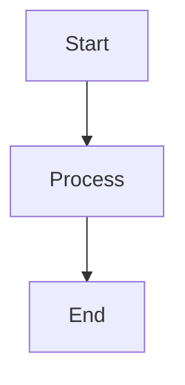

# CodeThink

An innovative, lightweight terminal-inspired Hugo theme for code experiments and thoughts.

## Features

- **Terminal Aesthetic**: Monospace fonts and clean, minimalist design
- **Dark/Light Mode**: Automatic theme detection with manual toggle (🌓 auto, ☀️ light, 🌙 dark)
- **Syntax Highlighting**: Nord theme with Chroma
- **Mermaid Diagrams**: Automatic lazy-loading when diagrams are present
- **Responsive Design**: Two-column layout on desktop, single column on mobile
- **SEO Optimized**: Open Graph, Twitter Cards, RSS feed
- **Fast & Lightweight**: No frameworks, vanilla CSS, minimal JavaScript

## Installation

1. Add the theme to your Hugo site:
   ```bash
   cd your-hugo-site
   git submodule add https://github.com/yourusername/codethink.git themes/codethink
   ```

2. Update your `config/_default/hugo.yaml`:
   ```yaml
   theme: codethink
   ```

## Configuration

### Basic Setup

```yaml
# config/_default/hugo.yaml
title: "Your Site Title"
baseURL: 'https://yoursite.com/'
theme: codethink

markup:
  goldmark:
    renderer:
      unsafe: true
  highlight:
    noClasses: false
    style: nord
```

### Site Parameters

```yaml
# config/_default/params.yaml
description: 'Your site description'

author:
  name: 'Your Name'
  bio: 'Your bio'
  avatar: '/path/to/avatar.png'

social:
  - name: 'Twitter/X'
    url: 'https://twitter.com/yourusername'
  - name: 'GitHub'
    url: 'https://github.com/yourusername'
  twitter: 'yourusername'  # For Twitter Card meta tag
```

### Menu Configuration

```yaml
# config/_default/menus.yaml
main:
  - name: Home
    url: /
    weight: 10
  - name: Topics
    url: /tags/
    weight: 20
  - name: Blog
    url: /blog/
    weight: 30
```

## Front Matter Options

### Posts

```yaml
---
title: "Your Post Title"
date: 2025-01-01
summary: "A brief summary"
tags: ["tag1", "tag2"]
draft: false
reading_time: true  # Show reading time (default: true)
toc: false          # Show table of contents (default: false)
---
```

## Mermaid Diagrams

Mermaid diagrams are automatically detected and rendered. Just use standard markdown code fences:

````markdown

````

## Dark Mode

The theme automatically respects system preferences and allows manual toggling:
- **🌓 Auto**: Follows system preference
- **☀️ Light**: Forces light mode
- **🌙 Dark**: Forces dark mode

The preference is saved in localStorage and persists across visits.

## Development

### Local Development

```bash
hugo server -D
```

### Build for Production

```bash
hugo --minify
```

## Browser Support

- Modern browsers (Chrome, Firefox, Safari, Edge)
- Respects `prefers-color-scheme`
- Respects `prefers-reduced-motion`

## License

MIT License - see LICENSE file for details.

## Credits

Inspired by:
- [terminal-hugo-theme](https://github.com/techbarrack/terminal-hugo-theme)
- [Anatole](https://github.com/lxndrblz/anatole)
- [Ink-Free](https://github.com/chollinger93/ink-free)

Created by Daniel Leston
